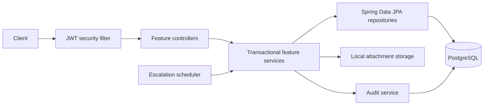

# IssueFlow

IssueFlow is a backend project and ticket management system built with Java 21 and Spring Boot. It focuses on enforceable workflow rules, dependency-aware ticket completion, role-aware operations, workload-based assignment, auditing, bulk CSV workflows, and attachment handling.

## What IssueFlow does

IssueFlow provides a stateless HTTP API for:

- managing users with `ADMIN` and `DEVELOPER` roles;
- creating projects and tracking their owners;
- managing tickets through a forward-only lifecycle;
- defining direct ticket dependencies and preventing completion while blockers remain unresolved;
- assigning tickets explicitly or selecting a developer based on project workload;
- adding comments and resolving `@username` mentions;
- escalating overdue ticket priority on a schedule;
- recording user- and system-initiated audit events;
- importing and exporting tickets as CSV; and
- storing attachment metadata in PostgreSQL while keeping file content on the local filesystem.

The API uses JWT authentication. Administrative operations, including user administration, audit-log access, and restoration of soft-deleted records, require the `ADMIN` role.

## Engineering highlights

- **Explicit lifecycle invariants.** New tickets begin in `TODO`; status changes move forward through `TODO`, `IN_PROGRESS`, `IN_REVIEW`, and `DONE`; and completed tickets are terminal.
- **Dependency-aware completion.** A ticket cannot move to `DONE` while any of its direct blockers is unresolved. Self-dependencies, duplicate dependencies, and cross-project dependencies are rejected.
- **Optimistic-locking groundwork.** Mutable ticket and comment entities use JPA `@Version`. The persistence layer can detect conflicting writes, although the API does not yet expose versions through an HTTP concurrency contract.
- **Transactional service boundaries.** Domain mutations and their audit entries share the same transaction, so a rolled-back mutation does not leave behind a successful domain audit record. Authentication security events use an explicitly separate transaction.
- **Actor-aware auditing.** `USER` identifies API-originated activity and records the authenticated user ID when one exists; `SYSTEM` identifies automated activity such as scheduled escalation.
- **Workload-aware assignment.** Automatic assignment selects the developer with the fewest active tickets in the project, with deterministic tie-breaking.
- **Scheduled escalation.** A scheduler raises the priority of overdue, incomplete tickets one level at a time and marks already-critical tickets as overdue.
- **Row-oriented CSV processing.** Apache Commons CSV is used to parse imports and produce row-level success or validation results. The current import runs within one service transaction; it is not an independently committed transaction per row.
- **Separated attachment storage.** Attachment metadata is persisted through JPA, while content is stored behind a filesystem storage service. This keeps binary data out of the relational model while making the storage tradeoff explicit.
- **Package-by-feature modular monolith.** Authentication, users, projects, tickets, comments, mentions, attachments, and auditing are organized as cohesive feature packages in one deployable Spring Boot application.

## Architecture

IssueFlow is intentionally a modular monolith. HTTP controllers validate and translate requests, transactional services enforce domain rules, and Spring Data JPA repositories persist the model in PostgreSQL.



The main feature packages are:

- `auth` for JWT authentication, password encoding, and security configuration;
- `user` for users, roles, and first-admin bootstrap;
- `project` for projects and ownership;
- `ticket` for tickets, dependencies, workload assignment, CSV workflows, and scheduled escalation;
- `comment` and `mention` for comments and persisted user mentions;
- `attachment` for metadata and filesystem-backed content; and
- `audit` for user- and system-originated activity records.

For a more detailed discussion of boundaries and tradeoffs, see [docs/architecture.md](docs/architecture.md).

## Domain rules

- Tickets are created in `TODO`, including tickets created through CSV import.
- Status may remain unchanged or advance, but cannot move backward; `DONE` tickets cannot be changed further.
- A ticket cannot be completed while one of its direct blockers is not `DONE`.
- Dependencies must connect different tickets in the same project and cannot be duplicated.
- Explicit assignees must have the `DEVELOPER` role.
- Comment authorship and attachment uploader identity are derived from the authenticated principal, not client-supplied user IDs.
- Public registration cannot create administrators. Creating an `ADMIN` through the API requires an authenticated administrator.

## Security

IssueFlow uses stateless JWT bearer authentication and BCrypt password hashing. Public access is limited to login and developer registration; other endpoints require authentication, with administrative endpoints protected by role checks.

The first administrator can be provisioned at startup through an opt-in bootstrap mechanism. It is disabled unless all three environment variables are provided:

```text
ISSUEFLOW_BOOTSTRAP_ADMIN_USERNAME
ISSUEFLOW_BOOTSTRAP_ADMIN_EMAIL
ISSUEFLOW_BOOTSTRAP_ADMIN_PASSWORD
```

Bootstrap creation occurs only when no administrator exists. It validates the supplied values, hashes the password through the normal password encoder, and is idempotent across restarts. Incomplete configuration creates no user.

IssueFlow currently uses role-based endpoint authorization rather than project-level ACLs. Authenticated users can access general project and ticket operations; `ADMIN` is required for administrative user operations, audit-log access, and restoration workflows.

## Technology

- Java 21
- Spring Boot 3.4.13
- Spring Security and stateless JWT authentication
- Spring Data JPA / Hibernate
- PostgreSQL 16 for application persistence
- Flyway versioned database migrations with Hibernate schema validation
- JJWT 0.12.6
- Apache Commons CSV 1.10.0
- Maven Wrapper
- JUnit 5, Spring Boot Test, Mockito, and PostgreSQL Testcontainers for tests

## Running locally

Requirements: Java 21 and Docker with Compose support.

Start PostgreSQL:

```bash
docker compose up -d postgres
```

For a first local run, optionally configure a bootstrap administrator and override the local JWT signing secret:

```bash
export JWT_SECRET='<a-random-secret-of-at-least-32-bytes>'
export ISSUEFLOW_BOOTSTRAP_ADMIN_USERNAME='local-admin'
export ISSUEFLOW_BOOTSTRAP_ADMIN_EMAIL='admin@example.test'
export ISSUEFLOW_BOOTSTRAP_ADMIN_PASSWORD='<a-strong-local-password>'
```

Start the application:

```bash
./mvnw spring-boot:run
```

The API listens on `http://localhost:8080`. The Compose database uses development-only credentials that match `application.yaml`; override the datasource and JWT settings for any non-local environment.

## Tests

Run the full suite with:

```bash
./mvnw test
```

The current suite combines database-free domain tests with PostgreSQL 16 Testcontainers integration tests. Flyway creates each empty integration database before Hibernate validates the schema, and focused tests cover PostgreSQL constraints, foreign-key behavior, and optimistic locking. H2 is not used.

## Example workflow

After provisioning an administrator, a typical API workflow is:

1. Authenticate with `POST /auth/login` and use the returned token as `Authorization: Bearer <token>`.
2. Create developer accounts with `POST /users` and a project with `POST /projects`.
3. Create two `TODO` tickets with `POST /tickets`, assigning them to developers or requesting automatic assignment.
4. Make one ticket block the other with `POST /tickets/{ticketId}/dependencies` and `{"blockedBy": <blockerTicketId>}`.
5. Attempting to move the blocked ticket to `DONE` fails until the blocker has been completed.
6. Complete the blocker, then advance the dependent ticket to `DONE`.

## Current limitations and engineering roadmap

The next engineering steps are deliberately focused rather than feature-driven:

- prevent transitive dependency cycles, beyond the current direct-dependency checks; and
- expose an explicit HTTP optimistic-concurrency contract using entity versions.
